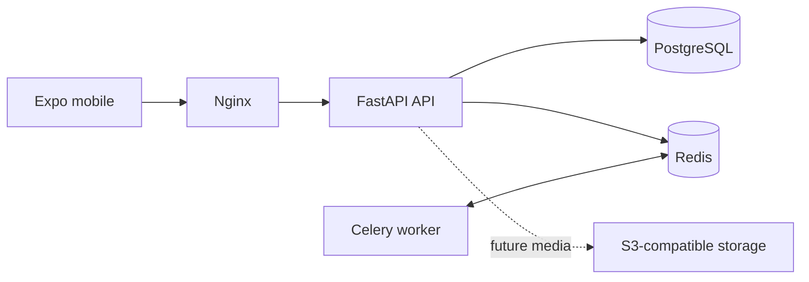

# Architecture

The platform is a modular monolith: Nginx is the public boundary, FastAPI owns HTTP and application lifecycle, PostgreSQL is the system of record, Redis supports cache, rate limiting, and Celery messaging, and Celery workers execute future asynchronous work. SQLAlchemy 2 uses async connections within the API; migrations are managed with Alembic.

Settings are validated on startup from environment variables. The application factory enables isolated tests and avoids global runtime state; dependency resources are held on the FastAPI application state and cleaned up during lifespan shutdown.

The identity bounded context owns users, credential versions, sessions, and one-time email tokens. HTTP handlers use dependency injection to obtain scoped database sessions and an identity service. The email port is implemented by a development logger and can be replaced by a production provider without changing domain code.
