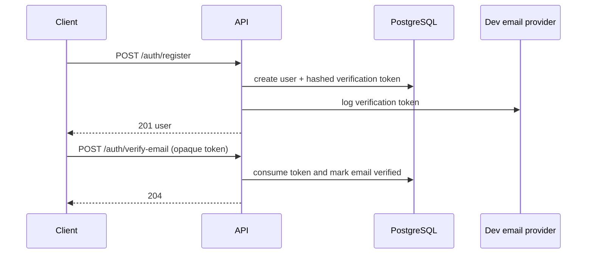
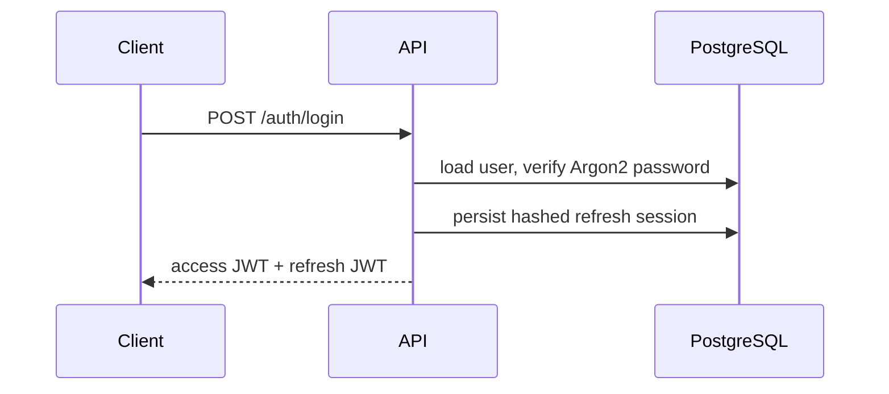
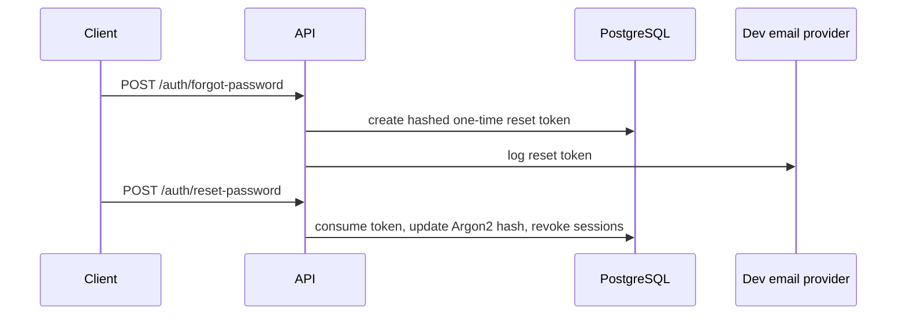

# Authentication

Identity is implemented as a bounded context with opaque one-time email tokens and signed JWTs. `User` stores a normalized email, Argon2 password hash, activity/verification flags, deletion time, and a credential version. Incrementing the credential version invalidates all existing access tokens.





```mermaid
sequenceDiagram
  participant C as Client
  participant A as API
  participant D as PostgreSQL
  C->>A: POST /auth/refresh
  A->>D: validate session and refresh-token hash
  A->>D: revoke old token; create replacement in same family
  A-->>C: rotated access + refresh JWTs
  Note over A,D: Reuse of revoked token revokes the active family
```


