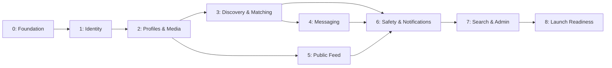

# Engineering Backlog

## Authority and operating rule

This backlog implements [PRD v1.0 (Frozen)](/Users/samanyu_bhad03/dating%20app/Prd.md). The PRD is authoritative for product scope. This document converts that scope into engineering milestones; it does not add product features. Items marked **verify/reconcile** require confirming that the existing implementation meets the frozen PRD before they are considered complete.

## Delivery order

## Shared delivery contract

Every backlog item requires: approved API/data contract, authorization design, migration plan where data changes, structured logging and errors, audit implications, OpenAPI updates, documentation, unit/integration tests, production-readiness review, and no TODO/placeholder/mock production implementation. See [AI Engineering Rules](../AI_ENGINEERING_RULES.md).

## Milestone 0 — Platform foundation (verify/reconcile)

**Dependencies:** none.

**Scope:** Confirm the existing Expo, FastAPI, PostgreSQL, Redis, Celery, Nginx, Docker, Alembic, CI, health, metrics, structured logging, request IDs, CORS, trusted-host, and security-header foundation continues to satisfy the current architecture documentation.

**Acceptance criteria:**

- Local Compose starts the API, PostgreSQL, Redis, worker, and Nginx.
- Health/readiness/metrics endpoints behave as documented.
- CI runs migration, lint, formatting, unit tests, and PostgreSQL/Redis-backed integration tests.
- Configuration is environment-driven; no runtime secret is committed.

**Testing requirements:** container startup/readiness test; migration-upgrade test; CI smoke test; regression suite for operational endpoints.

## Milestone 1 — Identity and account security (verify/reconcile)

**Dependencies:** Milestone 0.

**Scope:** Email/password registration, mandatory email verification, JWT access tokens, refresh rotation/replay containment, device sessions, password recovery/change, rate limiting, audit logs, and soft account deletion. Explicitly exclude Google, Apple, and phone-number login.

**Acceptance criteria:**

- A user cannot access future product capabilities until email verification succeeds.
- Passwords use Argon2 and PRD-aligned validation; plaintext is never persisted or logged.
- Access/refresh expiration, rotation, revocation, family replay handling, and session listing/revocation work end to end.
- Password reset/change and account deletion invalidate relevant sessions and create audit events.
- No social or phone authentication endpoint exists.

**Testing requirements:** registration/verification, invalid credentials, refresh replay, logout, password reset/change, session revoke, account deletion, rate-limit, and audit-log integration tests; negative authorization tests.

## Milestone 2 — Profile and media foundation

**Dependencies:** Milestones 0–1.

**Scope:** User profile data: display name, unique username, date of birth/derived age, gender, optional pronouns, 150-character bio, optional height, multiple interests, join date, and last-active timestamp. Support up to 12 photos and 3 profile videos. Establish media upload pipeline for JPEG, PNG, WebP, HEIC, MP4, and MOV; image limit 25 MB, video limit 100 MB; retain originals and create optimized variants; support background, retry, and chunked uploads.

**Acceptance criteria:**

- Profile validation enforces every frozen field/limit and unique username.
- Age eligibility enforces minimum age 18 without exposing date of birth publicly unless separately specified.
- Upload validation enforces allowed formats and size limits before persistence.
- Original and optimized media lifecycle is traceable; failed/background/chunked uploads can safely resume or retry.
- Users can only alter their own profile/media; deletion and access policy are documented.

**Testing requirements:** schema/migration tests; profile validation boundary tests; authorization tests; media MIME/size/limit tests; multipart/chunk/resume/retry integration tests; image/video transformation tests; object-storage failure and cleanup tests; mobile background-upload tests.

## Milestone 3 — Card discovery and mutual matching

**Dependencies:** Milestone 2.

**Scope:** Vertical card-based browsing with recommendations based only on shared interests, activity, and basic profile completeness. Implement likes, mutual-match creation, permanent matches, and unmatching. Explicitly exclude distance filters, premium filters, paid boosts, and match expiration.

**Acceptance criteria:**

- Discovery presents eligible profiles in vertical cards and does not use location/distance, premium filters, or boosts.
- Recommendation inputs are limited to the three PRD-listed factors and are observable/testable.
- A match exists only after reciprocal likes; duplicate/concurrent likes create at most one match.
- A match does not expire; either participant can unmatch; unmatching removes messaging entitlement.

**Testing requirements:** recommendation deterministic tests; candidate eligibility tests; no-distance regression tests; duplicate/concurrent like tests; mutual-match transaction tests; unmatch authorization and messaging-entitlement tests; mobile card interaction tests.

## Milestone 4 — Match-gated messaging

**Dependencies:** Milestone 3; media foundation from Milestone 2.

**Scope:** Messaging is available only to matched users. Support text, images, videos, and replies. Explicitly exclude voice notes, editing, read receipts, typing indicators, reactions, and disappearing messages.

**Acceptance criteria:**

- Only active-match participants can create/read conversation content.
- Text, image/video attachment, and reply semantics are documented and correctly authorized.
- Unmatching removes future messaging access according to the documented access rule.
- No excluded messaging behavior is exposed in API, realtime events, or mobile UI.

**Testing requirements:** match-gate integration tests; sender/recipient authorization tests; attachment policy tests; reply-reference integrity tests; WebSocket/realtime delivery and reconnect tests; excluded-feature regression tests; message ordering/concurrency tests.

## Milestone 5 — Public feed

**Dependencies:** Milestone 2; identity from Milestone 1.

**Scope:** A public feed for each user containing photos and short videos with likes and comments. Explicitly exclude Stories and live streaming.

**Acceptance criteria:**

- Public-feed visibility and ownership are consistently enforced.
- Feed posts accept only approved media types and defined short-video treatment.
- Like and comment behavior is idempotent/consistent under concurrent use.
- Stories and livestream interfaces, routes, jobs, and notifications do not exist.

**Testing requirements:** feed visibility/authorization tests; post/media validation tests; like/comment concurrency tests; pagination/load tests after its contract is defined; mobile rendering/accessibility tests; excluded-feature regression tests.

## Milestone 6 — Safety controls and push notifications

**Dependencies:** Milestones 3–5 and identity.

**Scope:** User block/report controls; generic moderation interface that functions with no provider installed; push notifications for match, message, comment, like, and security events. Future-only privacy features (hide online status, private profile, invisible mode) are excluded from this milestone.

**Acceptance criteria:**

- Blocking prevents the documented interaction surfaces across discovery, matching, messaging, and feed.
- Reports are retained and reviewable through a provider-independent moderation interface.
- The application remains functional when no moderation provider is configured.
- Push events cover exactly the five approved event families and respect the final notification-permission behavior.
- No hide-online, private-profile, or invisible-mode feature is shipped.

**Testing requirements:** cross-surface block tests; report submission/audit tests; no-provider fallback tests; notification event contract tests; delivery/retry/opt-out tests once policy is defined; abuse/load tests for report paths.

## Milestone 7 — Search and administration

**Dependencies:** Milestone 6 and relevant source domains.

**Scope:** Search by username and display name only; admin capabilities to view users, suspend users, delete content, review reports, view audit logs, and view metrics. Explicitly exclude hashtags and advanced search.

**Acceptance criteria:**

- Search supports only the two approved fields and has documented authorization/rate-limit behavior.
- Administrative actions are role-protected, audited, reversible where applicable, and do not bypass safety/privacy controls.
- Suspension and content deletion affect dependent product surfaces consistently.
- No advanced search or hashtag endpoint/UI is delivered.

**Testing requirements:** search relevance/authorization/rate-limit tests; role-based admin integration tests; audit-log assertions; suspension/content-deletion propagation tests; authorization-bypass and privilege-escalation tests; admin accessibility tests.

## Milestone 8 — Launch readiness

**Dependencies:** Milestones 0–7.

**Scope:** Meet frozen targets: app launch under 2 seconds, feed load under 1 second, API P95 under 200 ms, and automatic background-upload retries. Validate English-only, global, iOS/Android-only MVP operation and WCAG 2.1 AA principles as applicable to mobile.

**Acceptance criteria:**

- Measured performance evidence meets all frozen targets under an agreed representative workload.
- Production deployment, HTTPS, secrets, monitoring, backups, rollback, alerts, and incident process are verified.
- Accessibility review documents conformance against WCAG 2.1 AA principles where applicable.
- Security review confirms PRD controls; release checklist and Definition of Done are satisfied.
- No excluded MVP feature is present: payments, subscriptions, premium, voice/video calls, stories, AI matchmaking, location tracking, livestreaming, web client, or creator economy.

**Testing requirements:** mobile launch/feed performance tests; API load test with P95 report; background-upload recovery tests; security/dependency scan; penetration/abuse review; accessibility test suite; device/OS matrix test; disaster-recovery/rollback rehearsal; production smoke test.

## Dependency register

| Capability | Requires |
| --- | --- |
| Profiles | Verified identity, media pipeline |
| Discovery | Profiles and eligibility rules |
| Matching | Discovery and transactional likes |
| Messaging | Active matches and media pipeline |
| Feed | Identity and media pipeline |
| Safety | All interaction surfaces it must constrain |
| Notifications | The source events in matching/messaging/feed/security |
| Search | Profile data and abuse controls |
| Admin | Audit logs, reports, users, content, metrics |

## Explicit non-goals guardrail

Do not schedule or implement payments, subscriptions, premium functions, voice/video calls, Stories, AI matchmaking, location tracking, livestreaming, a web client, creator-economy features, social login, phone login, distance filters, paid boosts, hashtags, or advanced search without a new approved PRD revision.
