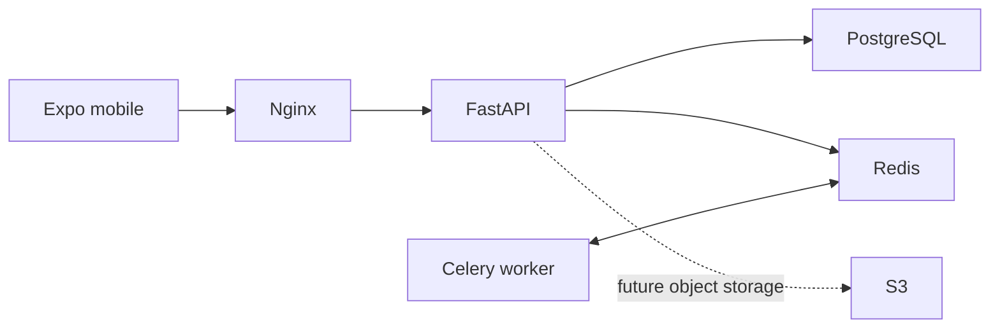

# Phase 1 Delivery Summary

## Folder Tree

```text
.
├── apps/{mobile,backend}
├── packages/{shared-types,shared-utils}
├── infrastructure/{docker,nginx,github}
├── docs
├── scripts
├── .github/workflows
├── docker-compose.yml
└── .env.example
```

## Architecture



The FastAPI application factory owns configuration validation, resource lifecycle, routing, CORS, trusted-host protection, security headers, request IDs, JSON logging, liveness/readiness checks, and Prometheus metrics. PostgreSQL and Redis are health-checked before the API starts. Nginx exposes the service; a Celery worker is launched in the same Compose stack.

## Local Startup

```sh
cp .env.example .env
docker compose up --build
```

Replace the example secrets in `.env` first. Use `http://localhost:8080/api/v1/health/live` and `http://localhost:8080/docs`.

## Next Phase

1. Define identity domain and JWT/refresh-token authentication.
2. Add Alembic domain migrations and user/profile aggregates.
3. Implement S3 media upload pipeline and asynchronous processing.
4. Introduce matching, messaging, WebSocket, and notification bounded contexts.
5. Add deployment environments, secret management, observability exporters, and release automation.
