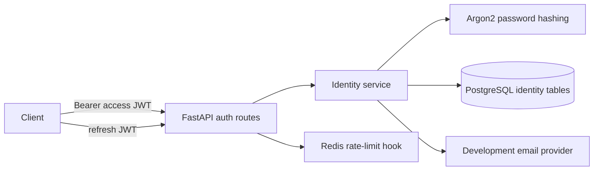

# Phase 2 — Authentication and Identity Foundation

## Updated Folder Tree

```text
apps/backend/
├── alembic/versions/20260718_01_identity_foundation.py
├── app/
│   ├── api/{auth.py,dependencies.py,middleware.py,router.py}
│   ├── core/{config.py,logging.py}
│   ├── domain/identity/{models.py,schemas.py,security.py,service.py}
│   └── infrastructure/{database.py,redis.py,email.py,celery_app.py}
└── tests/{test_health.py,test_identity_security.py}
docs/{Authentication.md,Security.md,APIAuthentication.md}
```

## Authentication Architecture



## Database Schema

```mermaid
erDiagram
  USER ||--o{ REFRESH_SESSION : owns
  USER ||--o{ EMAIL_VERIFICATION_TOKEN : receives
  USER ||--o{ PASSWORD_RESET_TOKEN : receives
  USER ||--o{ AUDIT_LOG : produces
  USER { uuid id PK
         string email UK
         string password_hash
         int credential_version
         datetime deleted_at }
  REFRESH_SESSION { uuid id PK
                    uuid family_id
                    string token_hash UK
                    datetime revoked_at
                    datetime expires_at }
```



## Endpoint Summary

`POST /auth/register`, `/login`, `/logout`, `/refresh`, `/verify-email`, `/resend-verification`, `/forgot-password`, `/reset-password`, `/change-password`; `GET /auth/me`, `/auth/sessions`; `DELETE /auth/sessions/{id}`, `/auth/account` — all under `/api/v1`. Details are in `docs/APIAuthentication.md`.

## Security Decisions

- Argon2 password hashes; no plaintext persistence.
- Password strength controls and baseline common-password rejection.
- Type-bound, expiry-bound access and refresh JWTs with a credential version.
- Hashed, rotated refresh sessions grouped into replay-detecting token families.
- Hashed, expiring, single-use opaque verification/reset credentials.
- Soft deletion, session revocation, audit logging, CORS/trusted-host controls, security headers, and Redis rate-limit hooks.
- Mobile bearer token delivery is documented; cookie/CSRF policy is documented for a future browser mode.

## Test Summary

`pytest -q`: **6 passed, 1 integration test skipped locally** because this environment does not provide Docker services. The CI workflow provisions PostgreSQL and Redis, applies the migration, and runs the end-to-end register → login → me → refresh/replay → logout flow. Local coverage includes health behavior, Argon2 verification/rejection, password policy, and JWT type enforcement. `ruff check .` and `black --check .` passed.

## Migration Summary

Revision `20260718_01` creates `users`, `refresh_sessions`, `email_verification_tokens`, `password_reset_tokens`, and `audit_logs`, including lookup, lifecycle, and token-family indexes. The backend image runs `alembic upgrade head` before starting the API.

## Local Startup

```sh
cp .env.example .env
docker compose up --build
```

Replace development secrets in `.env`. Use `http://localhost:8080/docs` and `http://localhost:8080/api/v1/health/ready`. Development verification/reset tokens are emitted to the backend’s structured logs.

## Suggested Commit

`feat(identity): add secure authentication and session foundation`

## Phase 3 Readiness Checklist

- [ ] Provision a real production email-provider adapter and templates.
- [ ] Store production secrets in a managed secrets service and define signing-key rotation.
- [ ] Add an integration-test PostgreSQL service to CI and exercise complete HTTP flows.
- [ ] Establish monitoring alerts for replay detection, login failures, and rate-limit saturation.
- [ ] Complete privacy/retention rules for audit records and deleted accounts.
- [ ] Review mobile secure-storage integration before clients consume tokens.

No profiles, avatars, media, discovery, matching, messaging, or dating-domain features were added.
